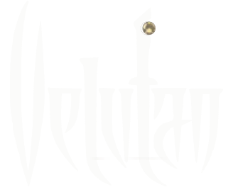

<div align="center">
  

  <h1>Velutan — İnteraktif 3D Dünya Haritası</h1>

  <p><em>Kayıp Dünyanın Kronikleri</em></p>

  <p><a href="https://velutan.com.tr"><b>velutan.com.tr</b></a></p>
</div>

---

Merhaba, ben Emre yani **w0fly**.

Bu repo, Velutan evreni için yaptığım Runeterra tarzı 3D dünya haritasının kaynak kodudur: yükseltili arazi, rüzgârda salınan on binlerce 3D ağaç, bölge kronikleri, karakter portreleri, 360° mekân gezintisi, seyahat ve mesafe hesaplayıcı ve editörlerin içerik girebildiği bir yönetim paneli.

Yaklaşık 11-12 aydır üzerinde çalıştığım, daha önce 3D web teknolojileriyle çalışma deneyimim olmadan girdiğim ve gece gündüz uğraştığım bir proje bu. En iyisini yaptığımı iddia etmiyorum; sadece işe yarayabilecek güzel bir şey sunduğumu düşünüyorum. Her müşterime söylediğim gibi: *"Web siteleri her zaman beta modundadır. Web bir moda gibidir ve her şey ilerledikçe güzelleşir."*

> **Bu repo neden burada?**
> Kod, teknik talepte bulunabilmeniz, hata ya da güvenlik açığı bildirebilmeniz ve neyin nasıl yapıldığını görebilmeniz için açık. Projeyi başka bir yerde yayınlamak, Dayı'nın yani **Swaggybark**'ın talebi, isteği ve ricası olmadan benim işim ya da görevim değil. Söz vermiştim, sözümü tutuyorum.

---

## ⚠️ Bu repoda neler YOK

Projenin kritik parçaları bilerek bu repoya konmadı. Kod derlenip çalıştırılabilir ama **tek başına bir harita ortaya çıkarmaz**:

| Eksik parça | Açıklama |
|---|---|
| Harita derleme hattı | El çizimi 8K katmanları 3D araziye, ağaçlara, isim katmanına dönüştüren araçlar |
| Kaynak çizimler | 8192×7192 su, kara, yol, sembol ve isim katmanları |
| Üretilmiş harita verisi | Zemin dokuları, yükselti/normal haritaları, ağaç verisi, isim atlası (`/map3d`) |
| İçerik veritabanı | Bölgeler, kronikler, görseller, 360° panoramalar |
| Sunucu yapılandırması | Dağıtım betikleri, nginx, ortam değişkenleri |

Uygulama bu verileri **resmi Velutan sunucularından** ister (`velutan.com.tr`, `api.velutan.com.tr`). Sunucular yalnızca resmi alan adlarına izin verdiği için kod başka bir adreste çalıştırıldığında harita ve içerik yüklenmez.

---

## 🏗️ Mimari

```
velutan/
├── frontend/      Harita — Next.js 14 · React Three Fiber · Three.js · GSAP · Tailwind
├── admin-panel/   İçerik paneli — Next.js 16 · PIXI.js koordinat seçici · rol tabanlı yetki
└── backend/       API — Node.js · Express 5 · yerleşik SQLite (node:sqlite) · JWT
```

### Harita (frontend)
- **Yükseltili arazi:** El çizimi zemin dokusu, yükselti haritasıyla gerçek 3D röliefe dönüşür; ışık bu yükseltiye göre düşer.
- **Ormanlar:** 25 binden fazla ağaç (çam, yapraklı, karlı, solmuş) tek çizim komutunda (*instancing*) çizilir, vertex shader ile rüzgârda salınır.
- **İsimler:** Zeminden ayrı bir katmanda, her kelime altındaki en yüksek noktanın üzerinde düz durur; dağlarla birlikte bükülmez.
- **Kamera:** Runeterra tarzı: uzaktan neredeyse tepeden bakar, yaklaştıkça eğilir. Zoom imlecin olduğu yere yapılır; touchpad pinch ve iki parmak kaydırma desteklenir.
- **Kalite seviyeleri:** Cihazın GPU belleğine ve doku limitine göre 4K / 2K doku seçilir. WebGL bağlamı kaybolursa kurtarma ekranı çıkar.
- **Kronikler ve 360°:** Bölgeye tıklayınca kronikler, karakter galerisi ve eşdikdörtgen (equirectangular) panoramalar açılır.
- **Seyahat:** Rota çiz; mesafe, arazi tipi ve tempoya göre süre hesaplanır, yolcu araziyi takip ederek ilerler.

### İçerik paneli (admin-panel)
- **Roller:** *Yönetici* tüm içeriği ve kullanıcıları yönetir; *Editör* yalnızca içerik girer.
- Bölge ekleme ve düzenleme, harita üzerinde koordinat seçme, lore metnine görsel ekleme.
- 360° görüntü yükleme, sıralama ve açılış açısını ayarlama; parola değiştirme.

### API (backend)
- Yazma işlemlerinin tamamı JWT ve rol kontrolünden geçer; girişte hız sınırı vardır.
- Bütün girdiler doğrulanır; yüklenen dosyalar MIME türüne ek olarak imza baytlarıyla da kontrol edilir.
- helmet güvenlik başlıkları, izin listeli CORS. Native modül gerekmez (`node:sqlite`, `bcryptjs`).

---

## 🐢 Neden bu kadar sürdü?

İlk sürüm 2D bir haritaydı (PIXI.js). Üç boyuta geçerken asıl savaş görsellikle değil, **performans ve render sorunlarıyla** verildi:

- **Bellek:** Yedi adet 8K katman ekran kartında ~1.6 GB yer kaplıyor, dizüstü ve mobilde çökmelere yol açıyordu. Katmanlar birleştirilip sıkıştırıldı.
- **Oranlar:** Kare formattaki harita 3D sahnede 16:9'a gerilmişti.
- **Ağaçlar:** Binlerce ağacı tek tek çizmek kare hızını öldürüyordu; instancing ve çizimden otomatik ağaç çıkarma gerekti.
- **İsimler:** Zemine gömülü isimler dağlarla birlikte bükülüyordu; ayrı katmana taşındılar.
- **Zoom takılması:** Her yakınlaştırmada 4K doku ekran kartına yeniden yükleniyordu; düzeltilince kare süresi 245 ms'den 15 ms'ye indi.
- **Kaydırma kilitlenmesi:** Kamera kontrolü sürükleme ortasında yeniden bağlanıyor ve pan kalıcı olarak donuyordu.

---

## 🙏 Teşekkürler

- **Intch** ve [velutanmap.com](https://velutanmap.com): Bu projenin en büyük ilham kaynağı. Bölge konumları, resmi ölçek ve 360° gezinti içerikleri oradan geliyor.
- **[Velutan Fandom Wiki](https://velutan.fandom.com/tr) editörleri:** Kronikler, karakter hikâyeleri ve portreler onların emeği.
- **Swaggybark (Alpcan Alpar):** Velutan'ı yaratan, dayımız. CanGPT'den ve w0fly'dan selam!

---

## 📬 İletişim

- **Discord:** w0fly
- **E-posta:** hi@nitrobyte.com.tr
- **Teknik konular ve güvenlik:** Bir şey mi buldunuz? Ya fork atın ya da yazın: teknik@nitrobyte.com.tr

Bu proje geliştirmeye ve uzatılmaya açıktır; teknik talep ve önerilerinizi issue olarak bekliyorum.

> Uzun lafın kısası, insanlara faydalı olmaya çalışın. Yardımcı olun. Faydanın ve yardımın size illaki güzel geri dönüşü olacaktır. Şayet bana olmadıysa, en azından size olsun.

<div align="center"><b>Sadece Velutan.</b></div>

---

<sub>© w0fly. Tüm hakları saklıdır. Ayrıntılar için <a href="LICENSE">LICENSE</a>.</sub>
